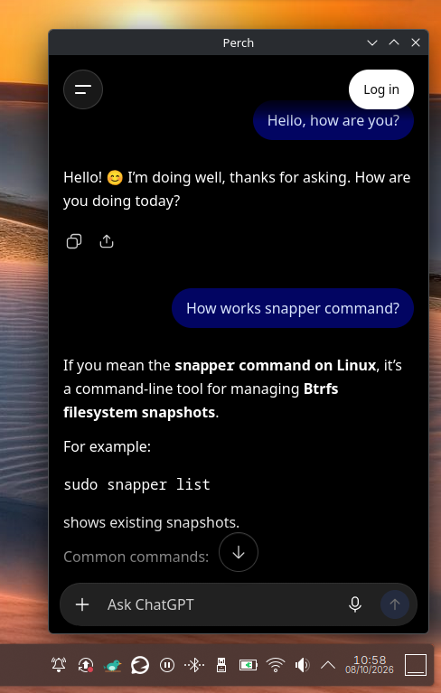

<div align="center">


# Perch

**Keep any AI chat one click away in your system tray.**
<p align="center">
  
  
</p>


</div>

---

## Table of Contents

- [About](#about)
- [Features](#features)
- [Usage](#usage)
- [Installation](#installation)
  - [Dependencies](#dependencies)
  - [Build from source](#build-from-source)
  - [Flatpak](#flatpak)
- [Configuration](#configuration)
- [Keyboard shortcut (recommended)](#keyboard-shortcut-recommended)
- [Translations](#translations)
- [Project structure](#project-structure)
- [Technical notes](#technical-notes)
- [Contributing](#contributing)
- [License](#license)
- [Author](#author)

---

## About

**Perch** sits quietly in your system tray and opens a compact chat window with a single click. Point it at any web-based AI assistant (Gemini, ChatGPT, Claude, Copilot, Perplexity, Mistral Le Chat, DeepSeek) or at any other web address, and it will be there whenever you need it.

It is not tied to any particular service: Perch simply hosts a web page inside a small, focused window that appears next to your panel and disappears when you click away.

## Features

- **Tray-first design:** lives in the system tray; left-click toggles the window, right-click opens the menu.
- **Works with any web service:** pick from built-in presets or enter any URL.
- **Built-in presets:** Gemini, ChatGPT, Claude, Copilot, Perplexity, Mistral Le Chat and DeepSeek.
- **Auto-hide:** the window hides when it loses focus, and also when you press <kbd>Esc</kbd>.
- **Smart placement:** opens at the bottom-right corner of the screen under your cursor, above the panel.
- **Persistent sessions:** cookies are stored, so you stay signed in between restarts.
- **Single instance:** running `perch` again toggles the existing window, which is ideal for global keyboard shortcuts.
- **External links:** links that ask for a new window open in your default browser.
- **Sign-in friendly:** configurable User-Agent (and Chromium Client Hints disabled) to avoid sign-in pages that reject embedded browsers.
- **Customizable size:** set the window width and height from the Settings dialog.
- **Localized:** English (source), Spanish and Portuguese, embedded in the executable.
- **KDE About dialog:** standard `KAboutApplicationDialog` integration.

## Usage

1. Launch **Perch** from your application menu, or run `perch` in a terminal.
2. On first run, the **Settings** dialog opens automatically. Choose a service from the list (or type any URL) and click **Save**.
3. Click the tray icon to show or hide the chat window.
4. Right-click the tray icon for the menu:
   - **Settings:** change the service, width and height.
   - **About:** version, author and license information.
   - **Quit:** exit Perch completely.

> Closing the window only hides it. Perch keeps running in the tray until you choose **Quit**.

## Installation

### Dependencies

| Requirement | Notes |
|---|---|
| C++20 compiler | GCC or Clang |
| [Meson](https://mesonbuild.com/) ≥ 1.3.0 and Ninja | Build system |
| Qt 6 | `Core`, `Gui`, `Widgets`, `Network`, `WebEngineWidgets` |
| KDE Frameworks 6 | `KF6CoreAddons`, `KF6I18n`, `KF6XmlGui` |
| Qt Linguist tools (`lrelease`) | *Optional.* Without it, Perch builds in English only. |

### Build from source

```bash
git clone https://github.com/FlaipyTheHost/perch.git
cd perch

meson setup build
meson compile -C build

# Optional: install system-wide
sudo meson install -C build
```

To run without installing:

```bash
./build/perch
```

The install step places the following files:

| File | Destination |
|---|---|
| `perch` | `<prefix>/bin` |
| `io.FlaipyTheHost.Perch.desktop` | `<prefix>/share/applications` |
| `io.FlaipyTheHost.Perch.svg` | `<prefix>/share/icons/hicolor/scalable/apps` |

> If `lrelease` is not found, Meson prints a warning and builds without translations.

### Flatpak

A Flatpak manifest (`io.FlaipyTheHost.Perch.yml`) is included. It uses the KDE runtime `6.11` together with the Qt WebEngine BaseApp.

```bash
flatpak-builder --user --install --force-clean build-dir io.FlaipyTheHost.Perch.yml
flatpak run io.FlaipyTheHost.Perch
```

You may need the KDE SDK, runtime and the `io.qt.qtwebengine.BaseApp` installed from Flathub first.

**Sandbox permissions:** GPU access (`dri`), Wayland and X11 (fallback) sockets, IPC, network, and the `org.freedesktop.Notifications` D-Bus name.

## Configuration

Perch stores its settings in an INI file:

```
~/.config/perch/config.ini
```

When running as a Flatpak, this file lives inside the app's sandboxed config directory (under `~/.var/app/io.FlaipyTheHost.Perch/`).

| Key | Default | Description | Editable in UI |
|---|---|---|:---:|
| `window/url` | *(empty)* | Address of the web service to load. | ✅ |
| `window/width` | `420` | Window width in pixels (240–3000). | ✅ |
| `window/height` | `640` | Window height in pixels (240–3000). | ✅ |
| `window/margin` | `8` | Distance from the screen edge in pixels (0–200). | ❌ |
| `network/user_agent` | Firefox 140 on Linux | User-Agent sent to websites. | ❌ |

Example:

```ini
[window]
url=https://claude.ai
width=420
height=640
margin=8

[network]
user_agent=Mozilla/5.0 (X11; Linux x86_64; rv:140.0) Gecko/20100101 Firefox/140.0
```

### About the User-Agent

Some sign-in pages (Google's, for example) refuse embedded browsers that identify themselves as QtWebEngine. Perch therefore presents itself as Firefox. If sign-in starts failing, bump the Firefox version in `network/user_agent`.

## Keyboard shortcut (recommended)

Because Perch is single-instance, running `perch` a second time simply **toggles** the window of the running instance. Bind the `perch` command to a global shortcut in your desktop environment (for example, in KDE: *System Settings → Keyboard → Shortcuts → Add Command*) to summon your AI assistant instantly.

## Translations

The source language is **English**. Included translations:

| Language | File |
|---|---|
| Spanish (`es`) | `translations/perch_es.ts` |
| Portuguese (`pt`) | `translations/perch_pt.ts` |

The language is chosen automatically from your system locale. Compiled `.qm` files are embedded in the executable, so there is no install path to get wrong. Qt's own translations (`qtbase`, `qtwebengine`) are loaded too, which localizes web view context menus.

**Adding a new language:**

1. Create `translations/perch_<lang>.ts` (for example with `lupdate`).
2. Register it in `translations/meson.build` (`ts_files`).
3. Add the matching `.qm` entry to `translations/i18n.qrc`.
4. Optionally add `GenericName[<lang>]` and `Comment[<lang>]` to the `.desktop` file.

## Project structure

```
perch/
├── meson.build                       # Build definition
├── io.FlaipyTheHost.Perch.yml        # Flatpak manifest
├── data/
│   ├── io.FlaipyTheHost.Perch.desktop
│   ├── io.FlaipyTheHost.Perch.svg    # App icon
│   └── resources.qrc                 # Embedded resources
├── translations/
│   ├── meson.build
│   ├── i18n.qrc
│   ├── perch_es.ts
│   └── perch_pt.ts
└── src/
    ├── main.cpp                      # Entry point, tray icon, single instance, translations
    ├── config.h                      # Settings load/save (config.ini)
    ├── popup_window.{h,cpp}          # Popup window hosting the web view
    ├── settings_dialog.{h,cpp}       # Settings dialog with service presets
    └── about.{h,cpp}                 # KDE About dialog
```

## Technical notes

- **Single instance:** implemented with `QLocalServer` / `QLocalSocket`, named after the app ID. A second launch sends a `toggle` message and exits.
- **Wayland:** native Wayland does not let applications position their own windows. Perch sets `QT_QPA_PLATFORM=xcb;wayland` (unless you already set it), so it runs through XWayland where possible and falls back to Wayland otherwise.
- **Web engine:** uses a dedicated persistent `QWebEngineProfile` named `perch` with forced persistent cookies. Chromium's `UserAgentClientHint` feature is disabled so the Client Hints agree with the configured User-Agent. Existing `QTWEBENGINE_CHROMIUM_FLAGS` are preserved.
- **Focus handling:** the popup hides on focus loss, but not when focus moves to another window of the app (such as a file chooser used for attachments) or to a menu. A short guard prevents the tray click that caused the auto-hide from immediately reopening the window.

## Contributing

Contributions, bug reports and feature ideas are welcome!

1. Fork the repository.
2. Create a feature branch: `git checkout -b feature/my-feature`
3. Commit your changes: `git commit -m "Add my feature"`
4. Push the branch: `git push origin feature/my-feature`
5. Open a Pull Request.

Translations are especially appreciated; see [Translations](#translations).

## License

Perch is free software licensed under the **GNU General Public License v3.0**. See the `LICENSE` file for details.

## Author

**Carlos Araújo** ([@FlaipyTheHost](https://github.com/FlaipyTheHost)): Lead Developer & Maintainer

© 2026 Carlos Araújo
